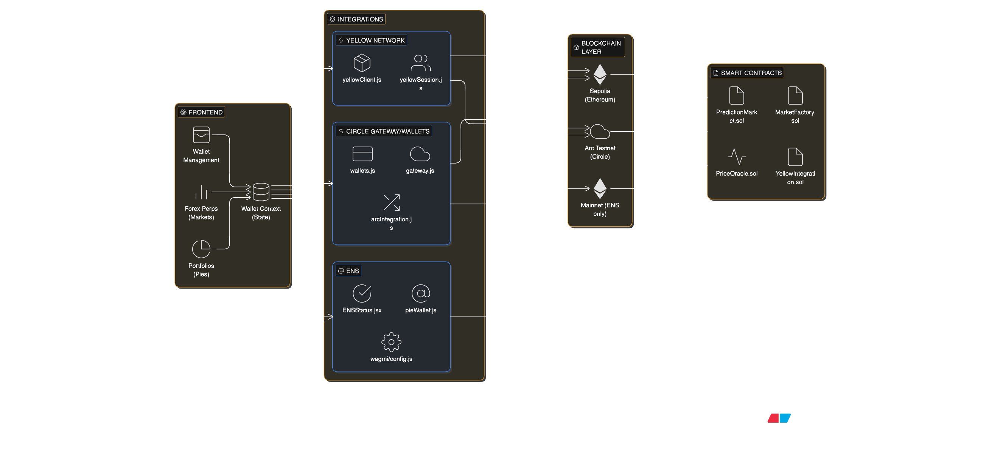

# Laxo

EthGlobal's 2026 HackMoney Submission

Laxo is a prediction market platform for forex currencies, powered by Yellow Network's state channels for instant off-chain transactions, Circle Gateway/Wallets for chain-abstracted USDC operations, and ENS for human-readable addresses.

## Features

- **10 Currency Prediction Markets**: USDC, EURC, JPYC, BRLA, MXNB, QCAD, AUDF, KRW1, PHPC, ZARU
- **Yellow SDK Integration**: Off-chain transactions via Nitrolite protocol (ERC-7824)
- **Circle Gateway & Wallets**: Chain-abstracted USDC operations across multiple blockchains
- **Arc Network Support**: Deploy and operate on Arc (Circle's L1) with USDC-native gas
- **ENS Integration**: Human-readable addresses for currency pies
- **Instant Transactions**: Zero gas fees for position taking through state channels
- **On-Chain Settlement**: Final settlements executed via smart contracts
- **Oracle-Based Resolution**: Markets resolve using price oracles

## Architecture



## Project Structure

```
Laxo/
├── contracts/              # Smart contracts (Hardhat)
│   ├── contracts/src/      # Solidity contracts
│   ├── test/              # Contract tests
│   ├── scripts/            # Deployment scripts
│   └── hardhat.config.js   # Hardhat configuration
├── frontend/               # Next.js frontend
│   ├── app/               # Next.js app directory
│   └── lib/yellow/        # Yellow SDK integration
└── README.md
```

## Prerequisites

- Node.js 16+ and npm
- MetaMask or compatible Web3 wallet
- Sepolia testnet ETH (for contract deployment)
- Alchemy/Infura account (for RPC endpoint)

## Setup

### Frontend

From the repo root:

```bash
cd frontend
npm install
npm run dev
```

The frontend will be available at `http://localhost:3000`

### Smart Contracts

From the repo root:

```bash
cd contracts
npm install
```

## Smart Contract Deployment

### 1. Configure Environment

Create a `.env` file in the `contracts/` directory:

```bash
cd contracts
cp env.example .env
```

Edit `.env` with your values:

```env
SEPOLIA_RPC_URL=https://eth-sepolia.g.alchemy.com/v2/YOUR_API_KEY
# PRIVATE_KEY is only needed if deploying contracts (see below)
# PRIVATE_KEY=your_private_key_here
ETHERSCAN_API_KEY=your_etherscan_api_key_here
```

**Note**: `PRIVATE_KEY` is only required if you're deploying contracts. If contracts are already deployed and you're just using the frontend, you can skip it.

**Important**: Never commit your `.env` file or private keys to version control.

#### Getting Your API Keys (All Free!)

##### 1. Deployer Key

**Only needed if you're deploying contracts yourself!** If contracts are already deployed and you're just using the frontend with test wallets, you can skip this entirely.

**⚠️ SECURITY WARNING**: Never share your private key or use your main wallet's private key for development!

**Option A: Get Private Key from MetaMask (Easiest)**

1. Open MetaMask browser extension
2. Click the account icon (circle) at the top
3. Click "Account Details"
4. Click "Show Private Key"
5. Enter your MetaMask password
6. Copy the private key (starts with `0x...`)
7. Add it to your `.env` file as `PRIVATE_KEY=0x...`

**Option B: Create a New Test Wallet (Recommended for Safety)**

1. In MetaMask, click the account icon → "Create Account"
2. Name it something like "Test Deployer"
3. Follow steps above to get the private key
4. This keeps your main wallet separate from deployment

**Option B: Generate a Test Wallet**

You can also generate a new wallet specifically for testing:

```bash
# Using Node.js (one-liner)
node -e "console.log(require('crypto').randomBytes(32).toString('hex'))"
```

Then use this private key (without `0x` prefix) or add `0x` prefix when adding to `.env`.

**Get Sepolia Testnet ETH:**
- Visit a Sepolia faucet: https://sepoliafaucet.com or https://faucet.quicknode.com/ethereum/sepolia
- Send your wallet address to receive free testnet ETH

**Advanced: Encrypted Private Keys (Like Scaffold-ETH 2)**

Some frameworks like scaffold-eth-2 use encrypted private keys with passwords. For this project, we use plain `.env` files for simplicity, but you can:
- Use password managers to store private keys
- Use hardware wallets for production deployments
- Use CI/CD secrets for automated deployments
- Consider using `@nomicfoundation/hardhat-toolbox` encryption features

For testnet development, a plain private key in `.env` (gitignored) is perfectly fine and standard practice.

##### 2. **ETHERSCAN_API_KEY** (Free)

Used to verify your deployed contracts on Etherscan:

1. Go to https://etherscan.io/apis
2. Click "Sign Up" (or "Login" if you have an account)
3. After logging in, go to https://etherscan.io/myapikey
4. Click "Add" to create a new API key
5. Name it (e.g., "Laxo Development")
6. Copy the API key and add it to your `.env` file

**Note**: The free tier is sufficient for contract verification.

##### 3. **SEPOLIA_RPC_URL** (Free)

You need an RPC endpoint to connect to Sepolia testnet. Options:

**Option A: Alchemy (Recommended)**
1. Go to https://www.alchemy.com/
2. Sign up for a free account
3. Create a new app:
   - Network: Ethereum
   - Chain: Sepolia
4. Copy the HTTPS URL (looks like `https://eth-sepolia.g.alchemy.com/v2/YOUR_API_KEY`)
5. Add to `.env` as `SEPOLIA_RPC_URL`

**Option B: Infura**
1. Go to https://infura.io/
2. Sign up for a free account
3. Create a new project
4. Copy the Sepolia endpoint URL (looks like `https://sepolia.infura.io/v3/YOUR_PROJECT_ID`)
5. Add to `.env` as `SEPOLIA_RPC_URL`

**Option C: Public RPC (No API Key Required)**
- You can use: `https://ethereum-sepolia-rpc.publicnode.com` (no signup needed, free public RPC)
- Note: `rpc.sepolia.org` is discontinued, use PublicNode instead

### 2. Compile Contracts

```bash
cd contracts
npm run compile
```

### 3. Run Tests

```bash
npm run test
```

### 4. Deploy to Sepolia Testnet

```bash
npm run deploy:sepolia
```

This will:
- Deploy `YellowIntegration` contract
- Deploy `MarketFactory` contract
- Deploy `MockERC20` (if no collateral token specified)
- Create prediction markets for all 10 currency pairs
- Save deployment addresses to `deployments/` directory
- Verify contracts on Etherscan (if API key provided)

### 5. Verify Contracts (Optional)

If verification didn't run during deployment:

```bash
npm run verify
```

## Yellow SDK Integration

### Overview

Laxo uses Yellow Network's Nitrolite protocol (ERC-7824) for off-chain state channel transactions. This enables:

- **Instant Payments**: No waiting for block confirmations
- **Zero Gas Fees**: Off-chain transactions don't require gas
- **Session-Based Spending**: Users can take positions instantly
- **On-Chain Settlement**: Final settlements are executed via smart contracts

### Architecture

```
User → Yellow SDK → ClearNode (State Channel) → Off-chain Transactions
                                              ↓
                                    Smart Contract Settlement
```

### Usage in Frontend

The Yellow SDK is integrated in `frontend/lib/yellow/`:

- **`yellowClient.js`**: Main client for connecting to Yellow Network
- **`yellowSession.js`**: Session management for prediction markets

Example usage:

```javascript
import { getYellowClient } from '@/lib/yellow/yellowClient'
import { createMarketSession } from '@/lib/yellow/yellowSession'

// Initialize client
const client = getYellowClient({
  endpoint: 'wss://clearnet-sandbox.yellow.com/ws' // Sandbox for testing
})

// Connect wallet and Yellow Network
await client.setupWallet()
await client.connect()

// Create session for a market
const session = createMarketSession(marketAddress, { client })
await session.initialize()

// Take position off-chain (instant, no gas)
await session.takePosition('long', '1000000') // 1 USDC
```

### Yellow Network Endpoints

- **Sandbox** (Testing): `wss://clearnet-sandbox.yellow.com/ws`
- **Production**: `wss://clearnet.yellow.com/ws`

## Circle Gateway & Wallets Integration

### Overview

Laxo integrates Circle Gateway and Circle Wallets to enable chain-abstracted USDC operations:

- **Circle Gateway**: Cross-chain USDC transfers (<500ms) across multiple blockchains
- **Circle Wallets**: User-controlled wallet management on Arc and other chains
- **Arc Network**: Deploy and operate on Circle's L1 with USDC-native gas

### Architecture

```
User → Circle Wallets API → Create Arc Wallet
  ↓
User → Circle Gateway API → Transfer USDC to Arc
  ↓
Gateway → Deposit on Source Chain → Mint on Arc
  ↓
Unified Balance → View USDC across all chains
```

### Usage

The Arc integration is available in the Wallet page:

1. Connect your wallet
2. Click "Initialize Arc Integration" to set up Circle Wallets
3. Create an Arc wallet for USDC operations
4. Transfer USDC to/from Arc via Circle Gateway
5. View unified balance across all supported chains

### Supported Chains

- Ethereum
- Base
- Polygon
- Avalanche
- Arbitrum
- Optimism
- **Arc** (Circle's L1)

### Configuration

Set environment variables for Circle API access:

```env
NEXT_PUBLIC_CIRCLE_API_KEY=your_circle_api_key
NEXT_PUBLIC_CIRCLE_ENTITY_SECRET=your_entity_secret  # Optional, for advanced features
```

Get your API key from [Circle Developer Console](https://console.circle.com/)

### Arc Network Deployment

Deploy contracts to Arc Testnet:

```bash
cd contracts
ARC_RPC_URL=https://rpc.testnet.arc.network npm run deploy:arc
```

**Note**: Arc uses USDC as native gas token. Ensure you have USDC in your wallet for gas fees.

## Smart Contracts

### PredictionMarket.sol

Main contract for individual prediction markets:

- Market creation with target price and resolution time
- Position taking (Long/Short)
- Oracle-based resolution
- Payout claiming for winners

### MarketFactory.sol

Factory contract for creating and managing multiple markets:

- Create markets for different currency pairs
- Batch market creation
- Query markets by currency pair

### YellowIntegration.sol

Helper contract for ERC-7824 state channel integration:

- Record off-chain positions
- Finalize settlements on-chain
- Track session data

## Testing

### Smart Contracts

```bash
cd contracts
npm run test
```

Tests cover:
- Market creation
- Position taking (Long/Short)
- Market resolution
- Payout claiming
- Yellow integration

### Frontend

The frontend includes manual testing capabilities:
- Connect wallet and Yellow Network
- Take positions in markets
- View positions and balances
- Test off-chain transactions

## Development

### Adding New Markets

Markets are created via `MarketFactory.createMarket()`:

```solidity
marketFactory.createMarket(
  "USDC/NEWPAIR",      // Currency pair
  collateralToken,      // Token address
  targetPrice,          // Target price (8 decimals)
  resolutionTime        // Unix timestamp
)
```

### Customizing Oracle

Update the oracle address in `MarketFactory`:

```solidity
marketFactory.setOracle(newOracleAddress)
```

## License

MIT

## Links

### Yellow Network
- [Yellow Network Documentation](https://docs.yellow.org)
- [ERC-7824 Specification](https://erc7824.org)

### Circle & Arc
- [Circle Gateway Documentation](https://developers.circle.com/gateway)
- [Circle Wallets Documentation](https://developers.circle.com/wallets)
- [Arc Network Documentation](https://docs.arc.network)
- [Circle Developer Console](https://console.circle.com/)

### ENS
- [ENS Documentation](https://docs.ens.domains)

### Development
- [Hardhat Documentation](https://hardhat.org/docs)
- [Wagmi Documentation](https://wagmi.sh)
- [Viem Documentation](https://viem.sh)
